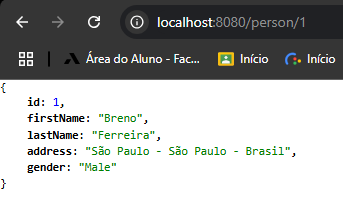
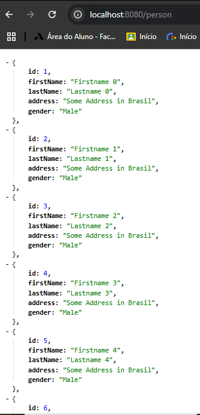

# javaSpringBootErudio2025

Projeto realizado para acompanhar o curso da udemy "Aprenda Spring Boot framework Swagger Docker Kubernetes K8s API RESTful
JWT JUnit 5 Mockito React JS do 0 à AWS e GCP e+" e aprender seus conceitos.

# Person

Este projeto implementa serviços HTTP (`POST`, `GET`, `DELETE` e `PUT`) utilizando Java com Spring Boot. Ele simula todos os serviços relacionados aos dados de uma pessoa, utilizando um [mock](#o-que-é-um-mock) como fonte de dados.

## FindByID

Retorna uma pessoa de acordo com o seu ID:

 

## FindAll

Retorna todas as pessoas presentes no [mock](#o-que-é-um-mock):

 

## O que é um Mock?

Um _mock_ é uma simulação de um objeto real. Em contextos de desenvolvimento e testes, mocks são usados para representar dados ou comportamentos esperados de componentes que ainda não foram implementados, ou que não se deseja acessar diretamente (como chamadas a APIs externas ou bancos de dados).

No contexto deste projeto, o _mock_ de pessoa é uma classe ou objeto com atributos pré-definidos (como nome, idade, CPF, etc.) que representa uma instância de `Person`. Ele é utilizado para simular uma requisição HTTP de criação de pessoa, facilitando o desenvolvimento e os testes do serviço sem depender de entradas externas.

## Spring Boot Initializr

Para gerar um novo projeto Spring Boot, acesse o [Spring Initializr](https://start.spring.io/).

### Dependências utilizadas:

- Spring Boot DevTools

- Spring Web

## Pré-requisitos

1. **Java 21**: Certifique-se de que o Java 21 está instalado na sua máquina.
2. **Docker**: Necessário para a execução de containers. Versão 27.4.0.
3. **MySQL**: Configuração do banco de dados. Versão 8.0.40.
4. **Postman**: Para testar a API.
5. **Java Spring Tool**: Framework na versão 3.3.7.
6. **Mvn**: Gerenciar as dependências e automatizar as builds. Versão 3.3.9.
