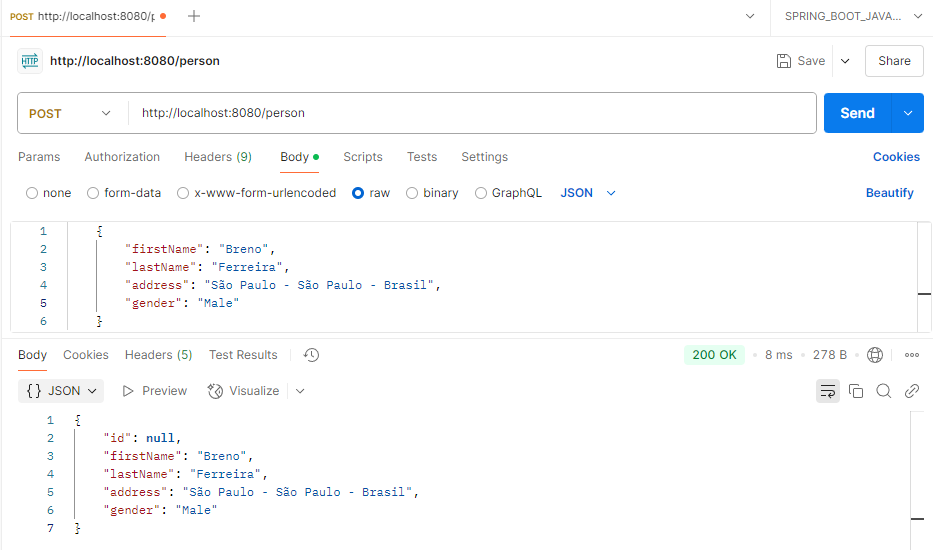
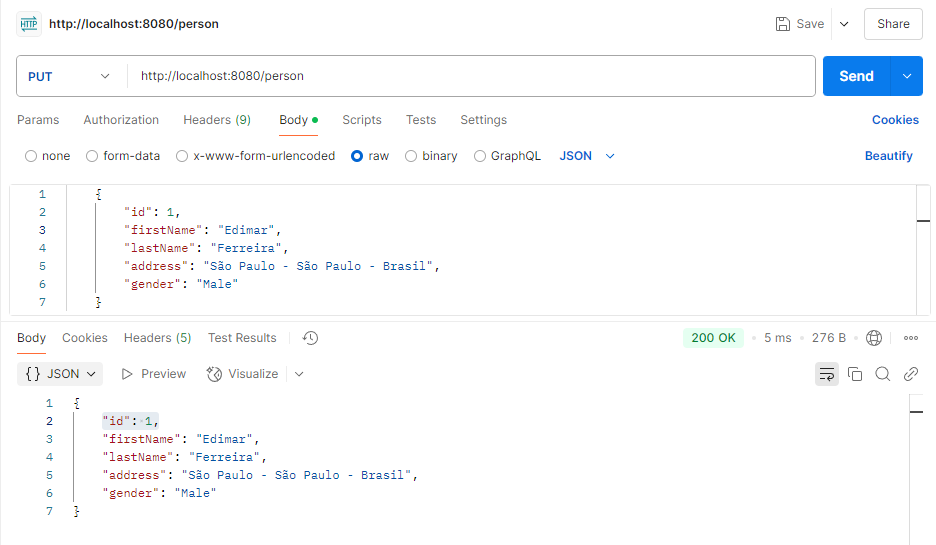
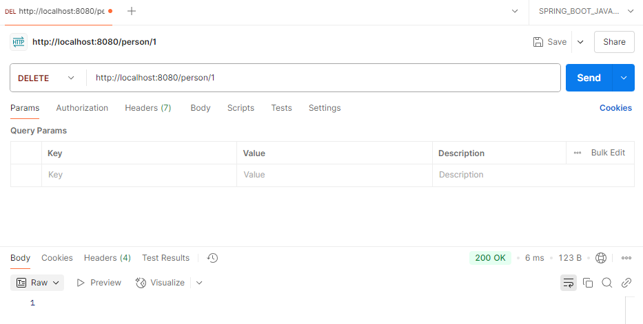
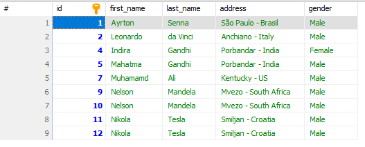
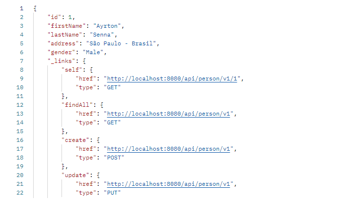
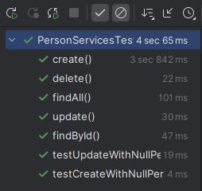

# javaSpringBootErudio2025

Projeto realizado para acompanhar o curso da udemy "Aprenda Spring Boot framework Swagger Docker Kubernetes K8s API RESTful
JWT JUnit 5 Mockito React JS do 0 à AWS e GCP e+" e aprender seus conceitos.

# Person

Este projeto implementa serviços HTTP (`POST`, `GET`, `DELETE` e `PUT`) utilizando Java com Spring Boot. Inicialmente, os dados eram simulados com [mocks](#o-que-é-um-mock), mas o projeto foi evoluído para realizar operações reais de CRUD utilizando um banco de dados MySQL com JPA (Java Persistence API).

## FindByID

Retorna uma pessoa de acordo com o seu ID:

<br>


## FindAll

Retorna todas as pessoas presentes:

<br>


## Create

Cria uma pessoa:

<br>



## Update

Atualiza os dados de uma pessoa:

<br>



## Delete

Deleta os dados de uma pessoa:

<br>



## Logs no Spring Boot

O projeto também utiliza logs para registrar o comportamento da aplicação durante a execução, facilitando o processo de depuração e monitoramento.

Para isso, foi utilizada a biblioteca **SLF4J** (Simple Logging Facade for Java), que fornece uma interface para diversas implementações de logging.

### Níveis de log disponíveis:

- `TRACE` – nível mais detalhado, geralmente usado para rastreamento fino
- `DEBUG` – informações úteis para desenvolvedores durante a depuração
- `INFO` – mensagens informativas sobre o fluxo normal da aplicação
- `WARN` – indica situações de alerta que não interrompem o sistema
- `ERROR` – indica falhas ou erros que exigem atenção

> Os logs ajudam a manter o controle do que está acontecendo na aplicação sem a necessidade de usar `System.out.println()`.

## Padrão DTO com Dozer Mapper

O projeto também adota o padrão **DTO (Data Transfer Object)** para separar a camada de apresentação dos modelos de entidade. Isso promove maior segurança, controle e clareza na exposição de dados via API.

Para realizar a conversão entre entidades e DTOs, foi utilizada a biblioteca **Dozer Mapper**, que simplifica o mapeamento automático entre objetos com estruturas semelhantes.

### Vantagens do uso de DTOs:

- Evita exposição direta de entidades JPA

- Facilita a criação de respostas customizadas

- Permite maior controle sobre os dados trafegados na API

- Ajuda na validação de entrada e saída de dados

> 📌 À medida que novos endpoints forem adicionados, novos DTOs serão criados para representar os dados da forma mais adequada para cada caso de uso.

## Migrações com Flyway

Este projeto utiliza a ferramenta **Flyway** para controle de versionamento e execução automática de migrações no banco de dados. Assim, garantimos que o esquema do banco esteja sempre sincronizado com o estado esperado da aplicação, independentemente do ambiente em que estiver rodando.

### O que é o Flyway?

O Flyway é uma biblioteca de versionamento de banco de dados que executa scripts SQL em sequência, com base em um esquema de versionamento (`V1__`, `V2__`, etc.). Ele mantém um histórico das migrações já aplicadas, evitando que scripts sejam executados mais de uma vez e facilitando o gerenciamento das mudanças no banco.

### Estrutura dos arquivos de migração

Os scripts SQL ficam localizados em:  
`src/main/resources/db/migration`

Cada arquivo de migração deve seguir a seguinte convenção de nomenclatura:  
`V<versão>__<descrição>.sql`

### Exemplo de arquivo de migração

```sql
V1__create_table_person.sql
```

### Benefícios de usar Flyway:

- Evita conflitos e inconsistências no banco entre ambientes
- Controla a ordem das alterações no esquema
- Permite reverter o estado do banco em ambientes de teste
- Mantém um histórico confiável das alterações aplicadas

> 📌 À medida que o projeto evolui, novas migrações serão adicionadas para refletir alterações nas entidades ou regras de negócio.

<br>



## Content Negotiation

Este projeto implementa **Content Negotiation**, permitindo que as requisições HTTP aceitem e retornem dados em múltiplos formatos, como:

- `application/json`
- `application/xml`
- `application/x-yaml`

Com isso, o cliente pode escolher o formato de resposta desejado utilizando o cabeçalho `Accept`.

### Vantagens

- Flexibilidade para integrar com diferentes tipos de clientes

- Melhora a interoperabilidade da API

- Facilita testes e desenvolvimento com ferramentas como Postman, Insomnia e cURL

> 📌 A configuração de Content Negotiation foi feita com base no uso do WebMvcConfigurer no Spring Boot, definindo os MediaType suportados e suas extensões correspondentes.

<br>


## HATEOAS

Este projeto implementa **HATEOAS (Hypermedia as the Engine of Application State)** para enriquecer as respostas da API com links de navegação relacionados às ações possíveis no recurso.

Cada resposta dos endpoints inclui referências para outras operações relevantes, como:

- **Create** – Criação de novos recursos
- **FindById** – Consulta de recurso específico
- **FindAll** – Listagem de todos os recursos
- **Update** – Atualização de dados
- **Delete** – Remoção de recurso

Isso facilita a navegação e a compreensão da API por parte do consumidor, promovendo um design mais RESTful.

<br>



## Testes unitários com Mockito e JUnit 5

Os testes unitários deste projeto são escritos utilizando **JUnit 5** em conjunto com o **Mockito**, garantindo a qualidade e a confiabilidade das funcionalidades da API.

As principais operações da API (Create, FindById, FindAll, Update e Delete) são testadas de forma isolada, com simulação de dependências externas através do Mockito.

### Benefícios:

- Validação automática do comportamento esperado da aplicação
- Redução de bugs e regressões em alterações futuras
- Facilidade de manutenção do código
- Maior confiança em deploys e integrações contínuas

Os testes estão localizados no diretório:  
`src/test/java/br/com/erudio/services/PersonServicesTest`

> 📌 À medida que novas funcionalidades forem implementadas, novos testes unitários serão adicionados para cobrir os cenários correspondentes.

<br>



## O que é um Mock?

Um _mock_ é uma simulação de um objeto real. Em contextos de desenvolvimento e testes, mocks são usados para representar dados ou comportamentos esperados de componentes que ainda não foram implementados, ou que não se deseja acessar diretamente (como chamadas a APIs externas ou bancos de dados).

No contexto deste projeto, o _mock_ de pessoa é uma classe ou objeto com atributos pré-definidos (como nome, idade, CPF, etc.) que representa uma instância de `Person`. Ele é utilizado para simular uma requisição HTTP de criação de pessoa, facilitando o desenvolvimento e os testes do serviço sem depender de entradas externas.

## Spring Boot Initializr

Para gerar um novo projeto Spring Boot, acesse o [Spring Initializr](https://start.spring.io/).

### Dependências utilizadas:

[pom.xml](https://github.com/BredexBR/javaSpringBootErudio2025/blob/main/javaSpringBootErudio2025/pom.xml)

## Pré-requisitos

1. **Java 21**: Certifique-se de que o Java 21 está instalado na sua máquina.
2. **Docker**: Necessário para a execução de containers. Versão 27.4.0.
3. **MySQL**: Configuração do banco de dados. Versão 8.0.40.
4. **Postman**: Para testar a API.
5. **Java Spring Tool**: Framework na versão 3.3.7.
6. **Mvn**: Gerenciar as dependências e automatizar as builds. Versão 3.3.9.
