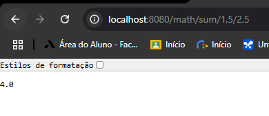

# javaSpringBootErudio2025

Projeto realizado para acompanhar o curso da udemy "Aprenda Spring Boot framework Swagger Docker Kubernetes K8s API RESTful
JWT JUnit 5 Mockito React JS do 0 à AWS e GCP e+" e aprender seus conceitos.

## Greeting

Implementa um serviço HTTP que retorna uma saudação personalizada.

- Quando um nome é fornecido na requisição, a resposta será: `"Hello, <nome>!"`.
- Caso nenhum nome seja informado, o retorno padrão será: `"Hello, World!"`.

### Exemplo de requisição

## Math

Este projeto implementa um serviço HTTP que realiza cálculos matemáticos simples, incluindo:

- Soma
- Subtração
- Multiplicação
- Raiz quadrada
- Média

### Exemplo de requisição

## Spring Boot Initializr

Para gerar um novo projeto Spring Boot, acesse o [Spring Initializr](https://start.spring.io/).

### Dependências utilizadas:

- Spring Boot DevTools

- Spring Web

## Pré-requisitos

1. **Java 21**: Certifique-se de que o Java 21 está instalado na sua máquina.
2. **Docker**: Necessário para a execução de containers. Versão 27.4.0.
3. **MySQL**: Configuração do banco de dados. Versão 8.0.40.
4. **Postman**: Para testar a API.
5. **Java Spring Tool**: Framework na versão 3.3.7.
6. **Mvn**: Gerenciar as dependências e automatizar as builds. Versão 3.3.9.
